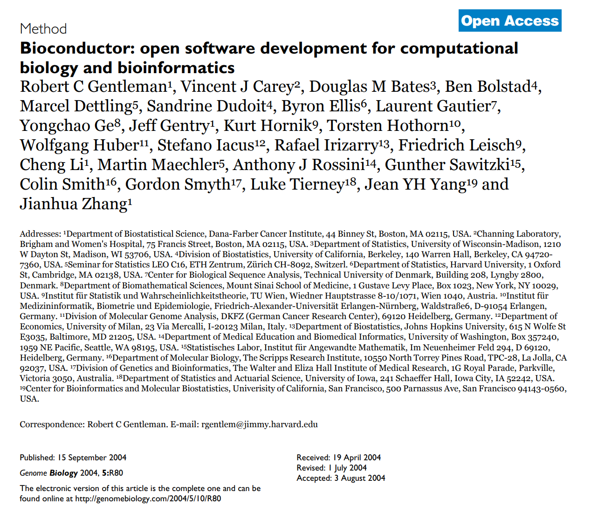

## [Acknowledgement Of Country]{.text-red}

::: {.text-red}

I’d like to acknowledge the Kaurna people as the traditional owners and custodians of the land we know today as the Adelaide Plains, where I live & work.

I also acknowledge the deep feelings of attachment and relationship of the Kaurna people to their place.

I pay my respects to the cultural authority of Aboriginal and Torres Strait Islander peoples from other areas of Australia, and pay my respects to Elders past, present and emerging, and acknowledge any Aboriginal Australians who may be with us today

:::

## Who Developed R?

- Developed at U Auckland by [Ross Ihaka](https://www.stat.auckland.ac.nz/~ihaka/) & [Robert Gentleman](https://hsph.harvard.edu/profile/robert-gentleman/)
- v1.0.0 released in Feb 2000
- Packages are hosted on the Comprehensive R Archive Network ([CRAN](https://cran.r-project.org))
    + This is where `install.packages()` looks
- CRAN packages are thoroughly tested across multiple platforms
- Cover diverse fields (finance, ecology, psychology, data wrangling etc)
- No formal versioning across packages

## The Bioconductor Project

:::: {.columns}
::: {.column}

- Robert Gentleman is a bioinformatician $\implies$ understood key needs of the field
- Started developing the Bioconductor Project in 2001
    + First official release v1.0 in May 2002 (R v1.5)

:::
::: {.column}

:::
::::

## The Bioconductor Project {.slide-only .unlisted}

<blockquote class="bluesky-embed" data-bluesky-uri="at://did:plc:kxrymabcfc3rhmpvzmymmx5o/app.bsky.feed.post/3mqmbyi7mo22h" data-bluesky-cid="bafyreibau5qsmg4bahemzm2gpd3oy66ot5jpqpgv546n7bzedr7mv7jtcy" data-bluesky-embed-color-mode="system">
With @helucro.bsky.social, @mikelove.bsky.social and Robert Gentleman at the Ukrainian Biological Data Science Summer School  <a href="https://bsky.app/profile/did:plc:kxrymabcfc3rhmpvzmymmx5o/post/3mqmbyi7mo22h?ref_src=embed">[image or embed]</a>
&mdash; Wolfgang Huber (<a href="https://bsky.app/profile/did:plc:kxrymabcfc3rhmpvzmymmx5o?ref_src=embed">@wkhuber.bsky.social</a>) <a href="https://bsky.app/profile/did:plc:kxrymabcfc3rhmpvzmymmx5o/post/3mqmbyi7mo22h?ref_src=embed">July 14, 2026 at 10:44 PM</a></blockquote>

    
## The Bioconductor Project {.slide-only .unlisted}
    
- Core data structures for genomic data as *core packages*
    + Sequence information, genomic co-ordinates etc
    + Specific file-types (bam files, bed files, gtf files)
- Core structures heavily used between packages
    + Strong dependency between packages
- Bi-annual releases $\implies$ *all packages released synchronously*
    + Install as an ecosystem of packages
    + Tied to (and tested on) specific version of R
    + Currently at Bioc release `r BiocManager::version()`

## Common Data Structures

For a microrray/RNA-Seq dataset we have three primary data objects

1. Sample annotations and metadata
2. Gene-Level information
3. Expression measurements (counts, fluoresence etc)

# References

##

::: {.content-visible when-format="beamer"}
\begingroup
\scriptsize
:::

::: {.content-visible when-format="revealjs"}
<!-- (no special size adjustment for HTML) -->
:::

<!-- This is where the bibliography gets injected -->
:::{#refs}
:::

::: {.content-visible when-format="beamer"}
\endgroup
:::
